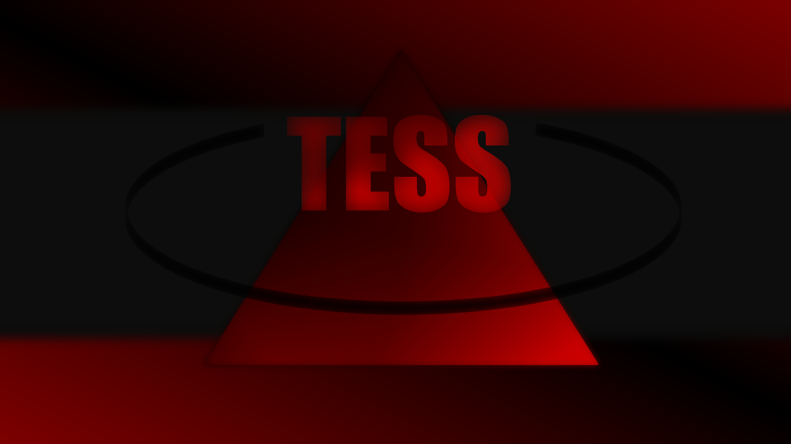

<p align="center">
  <a href="" rel="noopener">
    
  </a>
</p>

<h3 align="center">Discord Spy Bot</h3>

<div align="center">

[]()
[](https://discord.com)
[](https://github.com/recule556688/Spy_tess/issues)
[](https://github.com/recule556688/Spy_tess/pulls)
[](/LICENSE)

</div>

---

<p align="center"> 🤖 A Discord bot that quietly observes voice channels, takes detailed notes, and keeps its ears perked for interesting conversations... purely for quality assurance purposes, of course.
    <br>
<p align="center">
    and do actions related to certain keywords
    <br>
<p align="center">
    also remember that this bot is not for real-time surveillance, it's just for fun, trolling, and quality assurance purposes 😉
    <br>
</p>

## 📝 Table of Contents

- [About](#about)
- [How it Works](#working)
- [Usage](#usage)
- [Getting Started](#getting_started)
- [Configuration](#configuration)
- [Deploying Your Own Bot](#deployment)
- [Built Using](#built_using)
- [Authors](#authors)
- [Acknowledgements](#acknowledgement)

## 🧐 About <a name = "about"></a>

This bot is designed to join Discord voice channels, transcribe audio in real-time, and respond to specific keywords with predefined actions. It uses the Whisper model for transcription and can handle multiple channels across different servers.

## 💭 How it Works <a name = "working"></a>

The bot connects to a voice channel, records audio, and uses the Whisper model to transcribe the audio. It detects specific keywords in the transcription and performs actions such as sending messages or links in response.

### Auto-Join Feature

The bot can automatically join voice channels when users enter, start transcribing, and leave when the channel is empty. This feature was inspired by the strategic maneuvers of the Cold War between Russia and the USA, with a little wink to China for their innovative surveillance techniques. 😉

## 🎈 Usage <a name = "usage"></a>

To use the bot, you have two options: auto-join and manual commands.

## 🎯 Channel Configuration

- **Configure Channels**: Set up your dedicated channels for transcription output and bot responses:
  ```bash
  /set_transcription_channel  # Channel where transcripts will be posted
  /set_response_channel       # Channel where bot responses will appear
  ```

### Auto-Join Feature

The bot can automatically join a voice channel when users enter, start transcribing, and leave when the channel is empty. This feature ensures seamless operation without manual intervention. To activate auto-join, use:

```
/activate_auto_join
```

To deactivate, use:

```
/deactivate_auto_join
```

### Manual Commands

For manual control, you can use the following commands:

- **Join and Start Transcribing**: 
  ```
  /join
  /start_transcribing
  ```

These commands allow you to manage the bot's behavior and channel settings manually.

## 🏁 Getting Started <a name = "getting_started"></a>

These instructions will get you a copy of the project up and running on your local machine for development and testing purposes. See [deployment](#deployment) for notes on how to deploy the project on a live system.

### Prerequisites

What things you need to install the software and how to install them.

```
python3, pip, Discord account
```

### Installing

A step-by-step series of examples that tell you how to get a development environment running.

```
git clone https://github.com/recule556688/Spy_tess.git
cd Spy_tess
pip install -r requirements.txt
```

## ⚙️ Configuration <a name = "configuration"></a>

Create a `.env` file in the root directory to store your environment variables. This file should contain your Discord bot token:

```
DISCORD_BOT_TOKEN=your_discord_bot_token_here
```

Replace `your_discord_bot_token_here` with your actual Discord bot token. This token is essential for authenticating your bot with the Discord API.

End with an example of getting some data out of the system or using it for a little demo.

## 🚀 Deploying Your Own Bot <a name = "deployment"></a>

To deploy your bot, follow the instructions in the repository. Note that this project does not use Heroku.

## ⛏️ Built Using <a name = "built_using"></a>

- [Py-Cord](https://github.com/Pycord-Development/pycord) - Python Discord API Wrapper
- [Whisper](https://github.com/openai/whisper) - Speech recognition model

## ✍️ Authors <a name = "authors"></a>

- [@recule556688](https://github.com/recule556688) - Idea & Initial work

See also the list of [contributors](https://github.com/recule556688/Spy_tess/contributors) who participated in this project.

## 🎉 Acknowledgements <a name = "acknowledgement"></a>

- Hat tip to anyone whose code was used
- Inspiration from the strategic maneuvers of the Cold War between the USA and Russia, with a little wink to China for their innovative surveillance techniques. Remember, even in the digital world, it's all about who can hear you first! 😉
- References
- Special thanks to Vladimir Putin for inspiring us with his "transparent" approach to privacy.  
  Here's a totally-not-monitored gif of him 😏  
  